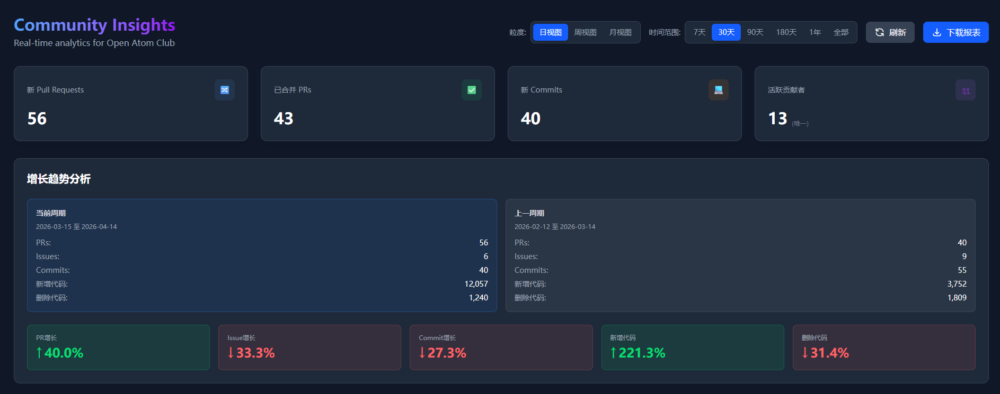
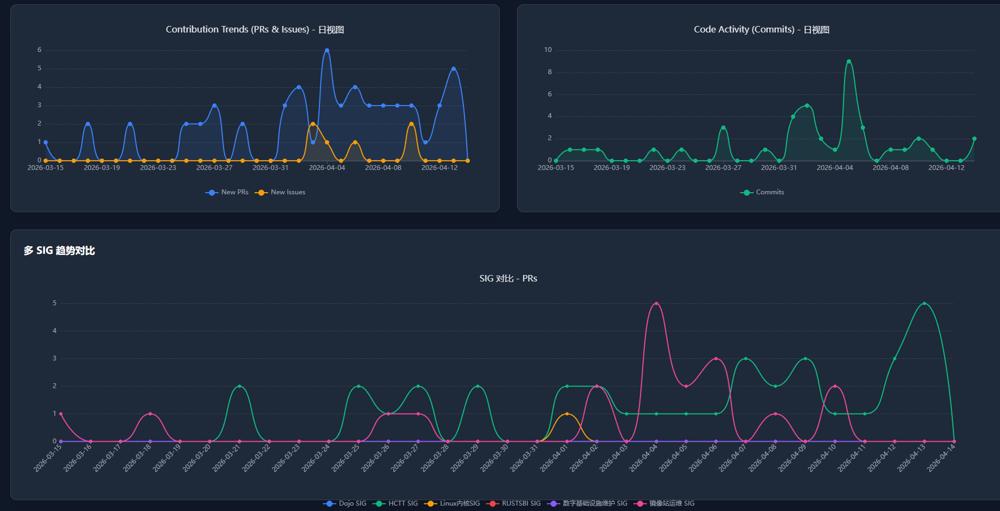

# 开源活动仪表板

面向 GitHub Organization 的开源活动数据采集与可视化系统。项目按“组织 → SIG → 仓库 → 贡献者”组织数据，帮助社区观察协作趋势、活跃项目和贡献者参与情况。

- 在线站点：[osd.openatom.club](https://osd.openatom.club/)
- 俱乐部主页：[hust.openatom.club](https://hust.openatom.club/)

## 核心能力

- 通过 GitHub GraphQL 和 REST API 采集默认分支 Commit、PR、Issue 与贡献者数据
- 按组织、SIG 和仓库三级聚合活动指标，支持日、周、月粒度与时间范围切换
- 展示趋势、增长分析、SIG 对比、活跃仓库和贡献者排行榜
- 使用 GitHub Repository Custom Property `osd_sig` 管理仓库与 SIG 的归属关系
- 提供数据更新时间状态，以及 CSV、Excel、PDF 导出
- 使用 PostgreSQL 持久化数据、Redis 缓存查询，并通过 Docker Compose 编排服务

## 界面预览

截图来自实际部署页面，展示默认 `30d` 时间范围与日视图。

### 30 天增长趋势



### 活动趋势与 SIG 对比



### 贡献者排行榜


## 快速开始

需要 Docker Engine 和 Docker Compose。

```bash
cp .env.docker.example .env
```

编辑 `.env`，至少设置：

```env
GITHUB_TOKEN=YOUR_GITHUB_PERSONAL_ACCESS_TOKEN
POSTGRES_PASSWORD=your_postgres_password
```

启动服务：

```bash
docker compose up -d --build
docker compose ps
```

默认访问地址：

- 前端：`http://localhost:8080`
- 后端：`http://localhost:3000`

首次启动不会自动回填历史数据。如果页面暂无图表数据，可执行：

```bash
docker compose exec backend node run_graphql_backfill.js 30
```

完整的 Docker、本机开发和数据库初始化步骤见[快速开始](docs/getting-started.md)。

## 文档

| 文档 | 内容 |
|------|------|
| [文档导航](docs/README.md) | 全部文档入口 |
| [快速开始](docs/getting-started.md) | Docker Compose、本机开发和数据库初始化 |
| [界面导览](docs/screenshots.md) | 组织概览、趋势、仓库洞察和贡献者界面 |
| [架构与数据口径](docs/architecture.md) | 技术栈、数据链路、仓库归属和统计规则 |
| [API 参考](docs/api.md) | 按核心数据、分析、贡献者、详情和导出分类的完整接口与参数 |
| [运行与维护](docs/operations.md) | 迁移、回填、重聚合、缓存和故障排查 |

## 开发验证

后端：

```bash
cd backend
npm install
npm test
```

前端：

```bash
cd frontend
npm install
npm run lint
npm run build
```

## 重要约定

- 组织内仓库的 SIG 归属来自 `osd_sig`；值为 `untracked` 的仓库不参与后续采集和组织/SIG 聚合。外部仓库在 [`backend/external_repositories.json`](backend/external_repositories.json) 中按 SIG slug 列出完整的 `owner/repo`，同步后计入对应 SIG 和本看板的仓库范围；RustSBI 项目归入 `r2`。
- Commit 总数与代码行统计来自 GitHub 默认分支历史。Bot 提交属于仓库活动，但 Bot 账号不计入人类贡献者指标。
- 服务启动时默认不清空 Redis，也不自动回填历史数据；高影响操作需要显式启用。
- 不要提交 Token、数据库密码、本地 `.env` 或其他凭据。
